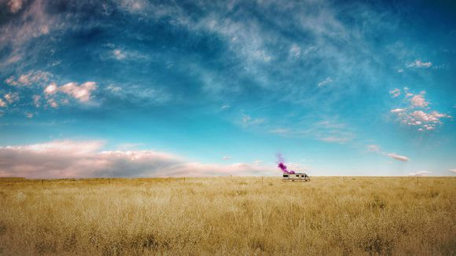

# flex布局初识
## 2015.11.25

实现垂直居中效果时，之前是使用绝对定位，但是对于响应式兼容太差，体验也不好，查阅资料后发现了flex布局可以非常简单的实现垂直居中，简单做了尝试。

### work1.html

图片使用绝对定位放于页面正中间，对文字使用flex定位。

html结构：

		
		<h1>我在正中间</h1>

css源码：

		html{
			/*高度撑满*/
			height: 100%;
		}
		body{
			/*body中设置flex布局*/
			display: flex;
			justify-content: center;
			align-items: center;
			width: 100%;
			height: 100%;		
		}
		img{
			/*在文字下层*/
			z-index: 1;
			position: absolute;
			left: 50%;
			margin-left: -290px;
			top: 50%;
			margin-top: -163px;
		}
		h1{
			/*在文字上层*/
			z-index: 2;
			/*设置水平垂直居中*/
			display: flex;
			justify-content: center;
			align-items: center;
		}

### work2.html

多图水平居中排列

html结构：

		

			

			

			

			

		

css源码：

		html{
			height: 100%;
		}
		body{
			height: 100%;
			width: 100%;
			display: flex;
			justify-content: center;
			align-items: center;
		}
		.container{
			display: flex;
			justify-content: center;
			align-items: center;
			width: 90%;
			height: 100%;
		}
		.box{
			display: flex;
			justify-content: center;
			align-items: center;
			float: left;
			width: 22%;
			height: 170px;
		}
		.box img{
			width: 100%;
			height: 100%;
		}
		.box1{
			margin-left: 4%;
		}